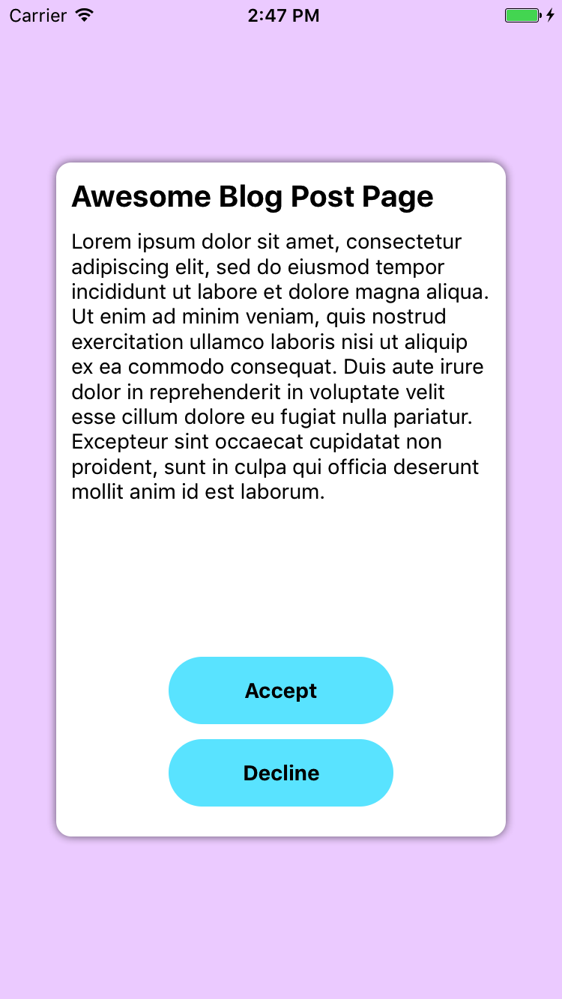
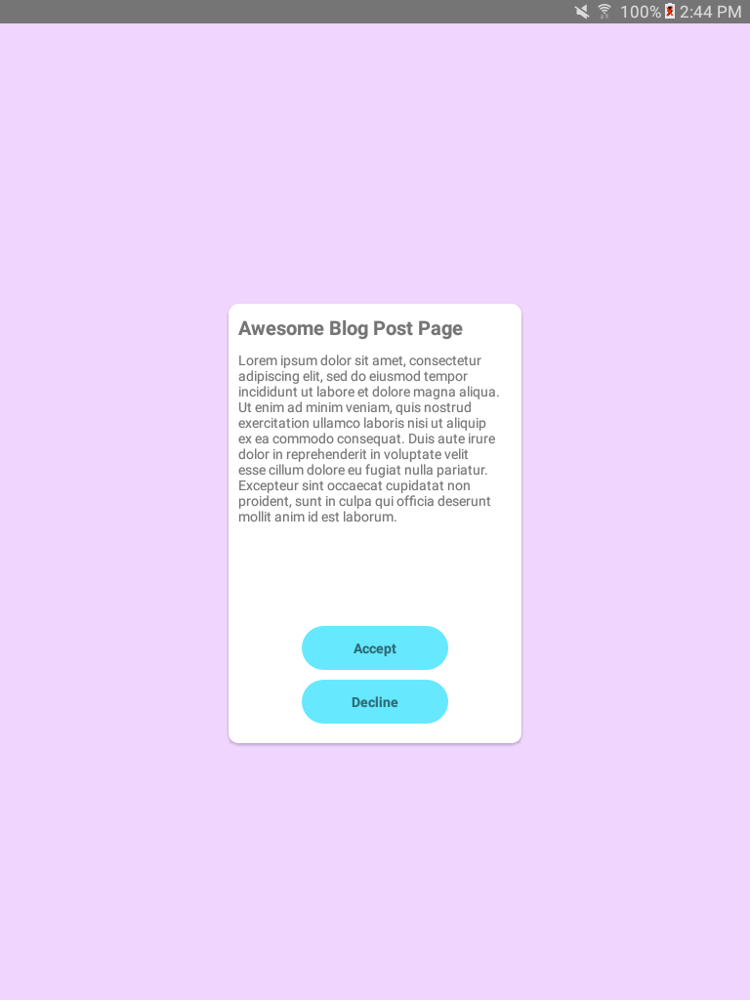
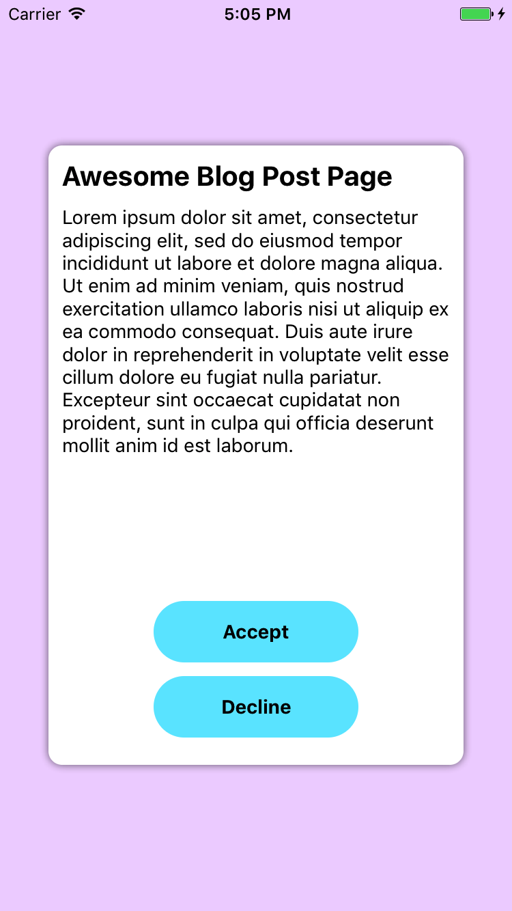
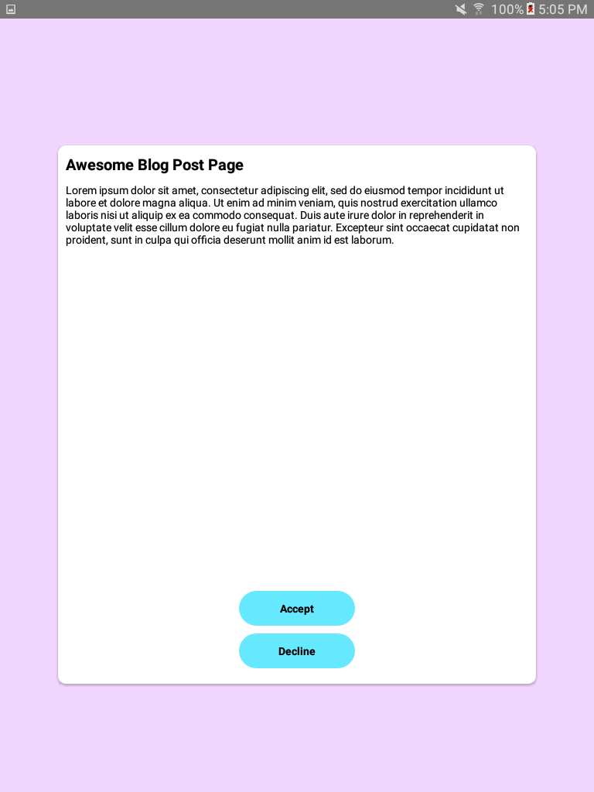
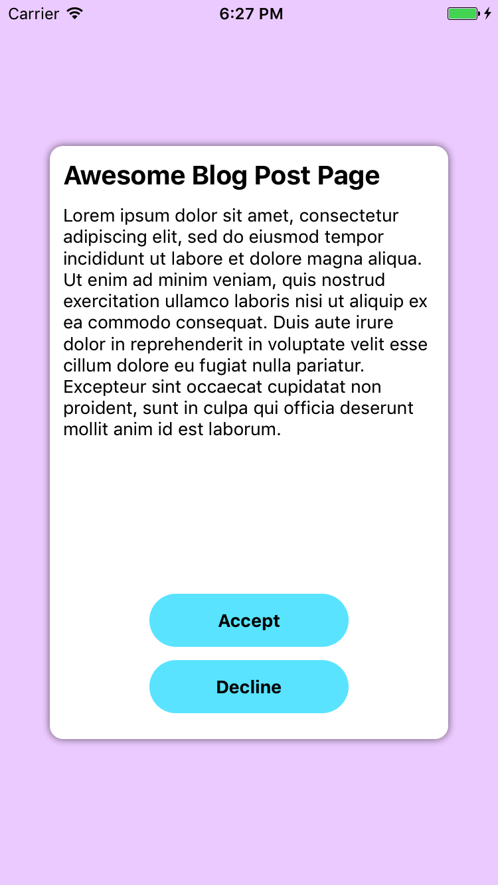
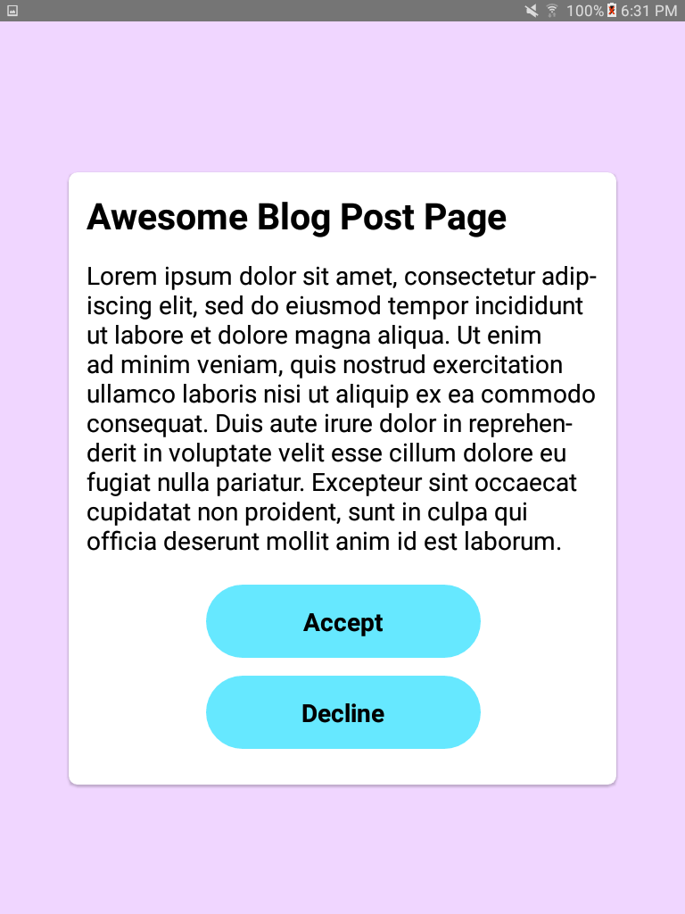
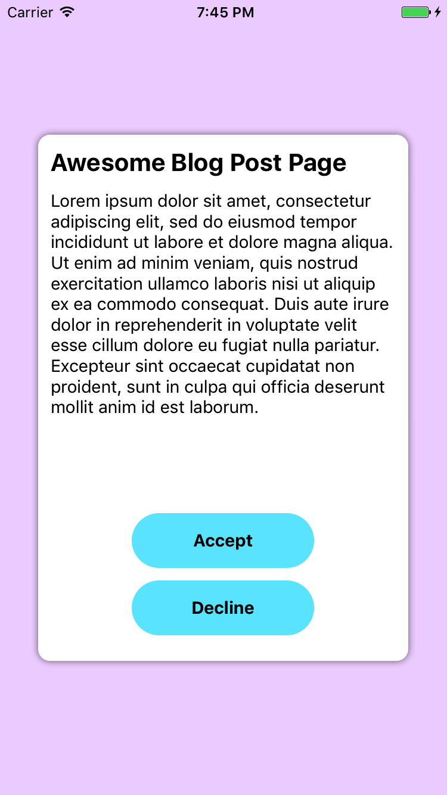
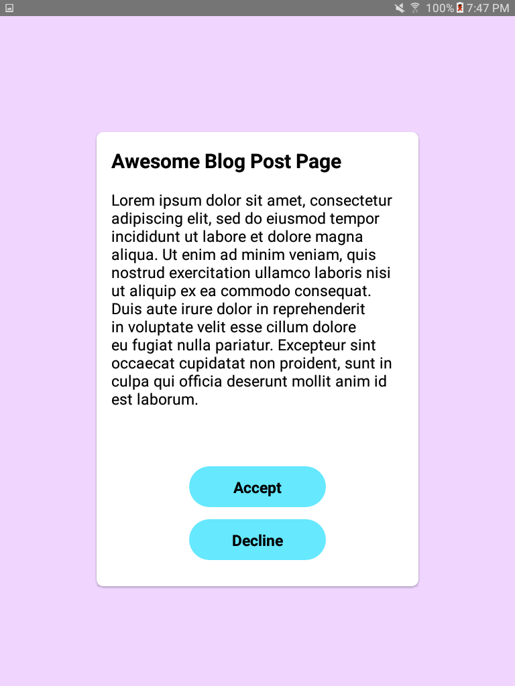

<h1>Make your React-Native app sexy on every size</h1>

*Every example on this post can be found [here](https://github.com/Nirsky/react-native-scaling-example).*

Did it ever happen to you that your designer handed you a cool design, 
you developed it on, let's say, an iPhone 7, 
and when you run it on an a Tablet everything looked like you left it too long at the dryer?
<br/>
That's probably because the design was created using dp (density pixels). 
To keep things simple - the bigger your device the more dp it'll have.
<br/>When working with React-Native, iPhone 7 has **375dp** width and **667dp** height and a Galaxy Tab A 8.0" Tablet (the one I'm using) 
has **768dp** width and **1024dp** height.<br/>
So while a `<View style={{width: 300, height: 450}}/>` will cover most of your iPhone screen 
it will cover less than half of your tablet screen.

<h3>So how can I make my app sexy on the tablet as well?</h3>
Oh! I'm glad you asked. On this blog post I'll show several methods to scale your components among 
different screen sizes, and which one I found best.  
For this purpose I created a small example app, and on every scaling method I'll attach the component's 
code along with a screenshot an a tablet and an iPhone.

<h3>No scaling example</h3>

So this is the component:
```javascript
import React from 'react';
import { View, Text, Dimensions, StyleSheet, TouchableOpacity } from 'react-native';
import { loremIpsum } from './contants';
const { width, height } = Dimensions.get('window');

const AwesomeComponent = () =>
    <View style={styles.container}>
        <View style={styles.box}>
            <Text style={styles.title}>Awesome Blog Post Page</Text>
            <Text style={styles.text}>{loremIpsum + '\nwidth: ' + width + '\nheight: ' + height}</Text>
            <View style={styles.buttonsContainer}>
                <TouchableOpacity style={styles.button}>
                    <Text style={styles.buttonText}>Accept</Text>
                </TouchableOpacity>
                <TouchableOpacity style={styles.button}>
                    <Text style={styles.buttonText}>Decline</Text>
                </TouchableOpacity>
            </View>
        </View>
    </View>;

export default AwesomeComponent;
```

And this is the StyleSheet:
```javascript
const styles = StyleSheet.create({
    container: {
        width: width,
        height: height,
        backgroundColor: '#F0D6FF',
        alignItems: 'center',
        justifyContent: 'center',
    },
    box: {
        width: 300,
        height: 450,
        backgroundColor: 'white',
        borderRadius: 10,
        padding: 10,
        shadowColor: 'black',
        shadowOpacity: 0.5,
        shadowRadius: 3,
        shadowOffset: {
            height: 0,
            width: 0
        },
        elevation: 2
    },
    title: {
        fontSize: 20,
        fontWeight: 'bold',
        marginBottom: 10,
        color: 'black'
    },
    text: {
        fontSize: 14,
        color: 'black'
    },
    buttonsContainer: {
        flex: 1,
        justifyContent: 'flex-end',
        alignItems: 'center'
    },
    button: {
        width: 150,
        height: 45,
        borderRadius: 100,
        marginBottom: 10,
        backgroundColor: '#66E8FF',
        alignItems: 'center',
        justifyContent: 'center',
    },
    buttonText: {
        fontWeight: 'bold',
        fontSize: 14,
        color: 'black'
    }
});
```

As you can see all my StyleSheet sizes are in dp units on no scaling was done.  
This will end up looking like this (Obviously I'm not a designer):

<div>
    
    
</div>

<br/>That's obviously not how we want our component to look like on the tablet (Did I say dryer already?).
 
<h3>Method 1: Flex</h3>

If you're not familiar with flex I urge to read about it online. 
[Here's a simple blog post you can start with](http://browniefed.com/blog/react-native-layout-examples/).  
When designing scalable component with flex you need to convert your View's size **and it's margins** with 
proportion the the parent component. So if for example our container's width is 375 and our box's width is 300 - 
the box's width is 80% of the parent (300/375) and the margins are what left - 10% on the left and 10% on the right.  
<br/>Here's an example how I *flexed* my component, I only flexed the white box and skipped flexing the buttons because I'm lazy,
 but you get the point (StyleSheet is the same except width and height was removed from `box`):
 
 ```javascript
const FlexExample = () =>
    <View style={styles.container}>
        <View style={{flex: 16}}/>
        <View style={{flexDirection: 'row', flex: 68}}>
            <View style={{flex: 1}}/>
            <View style={[styles.box, {flex: 8}]}>
                <Text style={styles.title}>Awesome Blog Post Page</Text>
                <Text style={styles.text}>{loremIpsum}</Text>
                <View style={styles.buttonsContainer}>
                    <TouchableOpacity style={styles.button}>
                        <Text style={styles.buttonText}>Accept</Text>
                    </TouchableOpacity>
                    <TouchableOpacity style={styles.button}>
                        <Text style={styles.buttonText}>Decline</Text>
                    </TouchableOpacity>
                </View>
            </View>
            <View style={{flex: 1}}/>
        </View>
        <View style={{flex: 16}}/>
    </View>;
```

And the result:
<div>
    
    
</div>
<br/>

Although the box has a good size on the tablet I personally don't recommend flexing you components.  
Flex can be an amazing solution for a lot of stuff but not for scaling, because..

* Results in a messy code with a lot of empty Views.
* You can only flex properties like width, height, margin and padding. Stuff like font-size or shadow-radius can't be flexed.
* Calculating everything with flex takes time, and as we know, time is money.

That said, we can now continue to our second method.
 
 <h3>Method 2: Viewport Units</h3>
On this method you basically convert every number you'd like to scale on your StyleSheet to 
a percentage of the device's width or height.  
So If your device's width is 375, 300dp will become `deviceWidth * 0.8` (300/375 = 0.8), 
and you can also do it on smaller numbers, for example `fontSize: 14` will become `fontSize: deviceWidth * 0.037`.  
A nice and straight-forward library that can simplify this method is [react-native-viewport-units](https://github.com/jmstout/react-native-viewport-units).  
<br/>
This is they StyleSheet after *viewporting* stuff around (irrelevant parts were removed, component is exactly the same as the first example):  

```javascript
import {vw, vh} from 'react-native-viewport-units';

const styles = StyleSheet.create({
    container: {
        ...
    },
    box: {
        width: 80 * vw,
        height: 67 * vh,
        padding: 2.6 * vw,
        ...
    },
    title: {
        fontSize: 5.3 * vw,
        marginBottom: 2.6 * vw,
        fontWeight: 'bold',
        color: 'black'
    },
    text: {
        fontSize: 3.6 * vw,
        color: 'black'
    },
    buttonsContainer: {
        ...
    },
    button: {
        width: 40 * vw,
        height: 10.7 * vw,
        borderRadius: 27 * vw,
        marginBottom: 2.6 * vw,
        ...
    },
    buttonText: {
        fontWeight: 'bold',
        fontSize: 3.6 * vw,
        color: 'black'
    }
});
```
 
And of course, what you all been waiting for, the result:
<div>
    
    
</div>
<br/>
Beside needing to do some calculation and having weird numbers around, pretty neat and easy right?  
But wait! You show your designer how it looks on the tablet and he thinks the buttons and the box's
width are too big. What can you do? If you reduce the viewports it will affect the iPhone as well.<br/>
     
One option is to do some something like HTML's `media-query` using [PixelRatio](https://facebook.github.io/react-native/docs/pixelratio.html),
but as I said, I'm lazy and I don't want to write everything 2 or more times, what can I do?

<p align="center">
    
</p>

 <h3>Method 3: Scaling Utils</h3>
 Here at Soluto, we wrote this 2 simple functions that makes our scaling so much easier:
  ```javascript
import { Dimensions } from 'react-native';
const { width, height } = Dimensions.get('window');

const scale = size => width / 350 * size;
const verticalScale = size => height / 680 * size;
const moderateScale = (size, factor = 0.5) => size + ( scale(size) - size ) * factor;

export {scale, verticalScale, moderateScale};
```

`scale` function is pretty straight-forward and will give you the same linear result as using viewport.
`verticalScale` is like scale but based on height instead of width.<br/>
The real magic happens at `moderateScale`. You can check the formula, but long story short - 
it won't 'exaggerate' when going on the big screen. You can also control the resize factor,
passing `1` as the resize factor will be like regular scale, and passing `0` will be like no scaling at all.<br/>

Anyway, enough talking, here are the results after combining `scale` and `moderateScale` until your designer is pleased.

StyleSheet:
```javascript
import { scale, moderateScale, verticalScale} from './scaling';

const styles = StyleSheet.create({
    ...
    box: {
        width: moderateScale(300),
        height: verticalScale(450),
        padding: scale(10),
        ...
    },
    title: {
        fontSize: moderateScale(20, 0.4),
        marginBottom: scale(10),
        ...
    },
    text: {
        fontSize: moderateScale(14),
        ...
    },
    button: {
        width: moderateScale(150, 0.3),
        height: moderateScale(45, 0.3),
        marginBottom: moderateScale(10, 0.6),
        ...
    },
    buttonText: {
        fontSize: moderateScale(14),
        ...
    }
});
```

Result:
<div>
    
    
</div>
<br/>
Like Morpheus said - a walk in the park :)<br/><br/>
What I didn't cover is scaling images (SVGs ftw) and handling orientation change, we'll keep that for a different post.
<br/>Hope you found this post useful, scaling is super important, even if your app is not released on tablet. 
Friends don't let friends skip scaling!